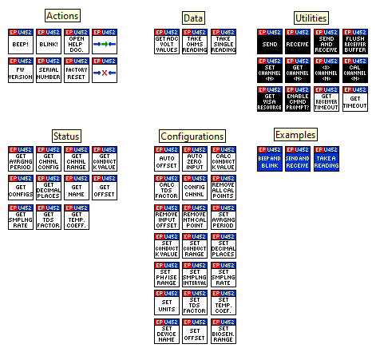

# Unofficial LabVIEW Driver for eDAQ EPU452

Easy to use LabVIEW drivers for eDAQ EPU452 Quad Multi Function isoPod.

The Official Manual and Drivers are located on: https://www.edaq.com/wiki/EPU452_Manual

# Minimum Requirements
* LabVIEW 2018 (32/64 bit)

# Developer Notes

Please feel free to contribute to the project, ask questions or report issues.

# Showcase

# Examples
**Send and Receive:**

**Take Readings:**

**Beep and Blink:**

- - -